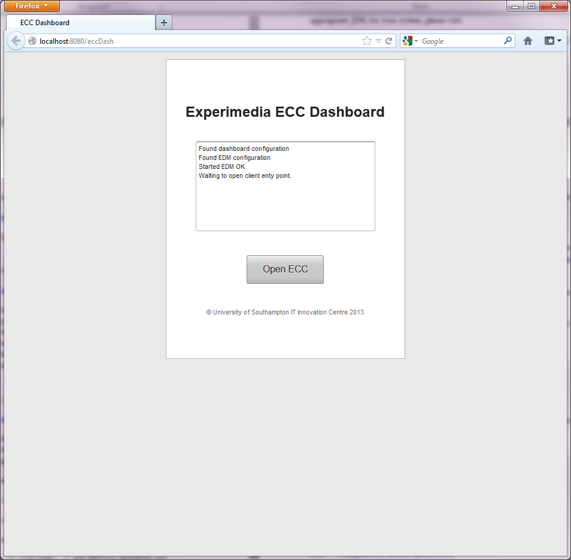

Getting started with the ECC
============================

The ‘bare bones’ software required for deploying and running the ECC are as follows:

*   Java JDK
    1.6

*   Maven 3.0

*   RabbitMQ
    server
    2.8.6
    (or better)

*   PostGreSQL 9.1

*   Apache Tomcat 7.x

*   The ECC software package

We advise running the sample applications provided in this release on an operating system and computer that meets the minimal requirements
of both RabbitMQ and PostGreSQL.

The following sequence of steps illustrates how to manually set up the ECC on a
single system (Microsoft Windows 7
in this case).
It should be noted that the RabbitMQ server can be deployed separately and remotely connected (given the appropriate IP address and access permissions).

Acquiring the ECC software package
----------------------------------

Before proceeding with installation of EXPERIMEDIA’s ECC, you will first need access to download the ECC package. Access is provided using an SVN server and must be arranged by permission. Please contact one of the following people to realise this:

*   Stephen Phillips (
    `scp@it-innovation.soton.ac.uk <mailto:scp@it-innovation.soton.ac.uk>`_
    )

*   Simon Crowle (
    `sgc@it-innovation.soton.ac.uk <mailto:sgc@it-innovation.soton.ac.uk>`_
    )

You will be provided with SVN login details after which you can download the software package, provided as a ZIP file, in the following location::

	.\trunk\ECC\<ECC version name>\<ECC version>.zip

Download and unzip this file. You will need to use its contents
later on in the set up process.

ECC Dependencies and Licenses
-----------------------------

This software requires various third-party libraries to compile and/or execute.
These libraries and their associated licences are:

+-----------------------------------------------------------+---------------------------------------------------+
|**Library Dependencies**                                   |  **License**                                      |
|                                                           |                                                   |                                
|                                                           |                                                   |                                
|                                                           |                                                   |                                
+===========================================================+===================================================+
|   |                                                       |                                                   |
|   | gson-2.2.2.jar                                        |                                                   |
|   | log4j-1.2.17.jar                                      | |                                                 |
|   | vaadin-6.8.2.jar                                      | | Apache Software Version 2.0                     |                                              
|   | gwt-user-2.3.0.jar                                    |                                                   |
|   | gwt-dev-2.3.0.jar                                     |                                                   |
|   | commons-cli-1.1.jar                                   |                                                   |                                                                                                   
|   | commons-io-1.2.jar                                    |                                                   |                                           
|   | javax.validation-api-1.0.0.GA.jar                     |                                                   |                                    
|   | javax.validation-api-1.0.0.GA-sources.jar             |                                                   |                                                        
|   | org.apache.maven.surefire:common-junit3:2.12.4.jar    |                                                   |                                                    
|   | org.apache.maven.surefire:common-junit4:2.12.4.jar    |                                                   |                                                     
|   | org.apache.maven.surefire:surefire-junit47:2.12.4.jar |                                                   |                                                                                      
|   | org.apache.maven.surefire:common-junit48:2.12.4.jar   |                                                   |                                                                                                 
|   | org.apache.maven.surefire:surefire-grouper:2.12.4.jar |                                                   |                                                                                                 
|   | joda-time-2.1.jar                                     |                                                   |                                                                                                         
|   | invient-charts-0.8.6.jar                              |                                                   |                                                                                                           
|   | icepush-0.2.1.jar                                     |                                                   |                                                                                                          
|   | icepush-3.0.1.jar                                     |                                                   |                                                                                                            
|   | RabbitMQ.Client.dll                                   |                                                   |                                                                                                          
|   | log4net.dll                                           |                                                   |                                
|                                                           |                                                   |                                                              
+-----------------------------------------------------------+---------------------------------------------------+
|   |                                                       |   |                                               |                                
|   | junit-4.10.jar                                        |   | CPL 1.0                                       |                                
|                                                           |                                                   |                                
|                                                           |                                                   |                                
+-----------------------------------------------------------+---------------------------------------------------+
|  |                                                        |                                                   |
|  | amqp-client-2.8.6.jar                                  |   |                                               |
|  | invient-charts-0.8.6.jar                               |   | GPL v2 / MPL v1.1                             |
|  | icepush-2.0.0-alpha3.jar                               |                                                   |
|  | icepush-gwt-2.0.0-alpha3.jar                           |                                                   |                                                               
|                                                           |                                                   |                                
+-----------------------------------------------------------+---------------------------------------------------+
|  |                                                        |   |                                               |                                
|  | servlet-api-2.3.jar                                    |   | CDDL / GPLv2 with classpath exception         |                                
|                                                           |                                                   |                                                              
+-----------------------------------------------------------+---------------------------------------------------+
| |                                                         |   |                                               |                                
| | postgresql-9.1-901.jdbc4.jar                            |   | BSD                                           |
| | org.hamcrest:hamcrest-core:1.1.jar                      |                                                   |
| | invient-charts-0.8.6.jar                                |                                                   |                                
|                                                           |                                                   |                                                             
+-----------------------------------------------------------+---------------------------------------------------+
| |                                                         |  |                                                |                                
| | invient-charts-0.8.6.jar                                |  | Creative Commons Attribution-NonCommercial 3.0 |                                
|                                                           |                                                   |                                
|                                                           |                                                   |                                
+-----------------------------------------------------------+---------------------------------------------------+
| |                                                         |                                                   |
| | Newtonsoft.Json.dll                                     |  |                                                |                                
|                                                           |  | MIT License                                    |                                
|                                                           |                                                   |                                                                                         
+-----------------------------------------------------------+---------------------------------------------------+
|   |                                                       |    |                                              |                                
|   | base64-2.3.8.jar                                      |    | Public domain                                |                                
|                                                           |                                                   |                                
|                                                           |                                                   |                                
+-----------------------------------------------------------+---------------------------------------------------+

Installing JavaJDK
------------------

The ECC system runs using Java 1.6. To build and run the ECC, you will need to install the appropriate JDK
for your system; please visit:

`http://www.oracle.com/technetwork/java/javasebusiness/downloads/java-archive-downloads-javase6-419409.html#jdk-6u41-oth-JPR <http://www.oracle.com/technetwork/java/javasebusiness/downloads/java-archive-downloads-javase6-419409.html#jdk-6u41-oth-JPR>`_

Installing Maven
----------------

The ECC build process is executed using Maven 3.0. You can download this here:

`http://maven.apache.org/download.cgi <http://maven.apache.org/download.cgi>`_

Some development systems (such as NetBeans) come with Maven included.

Installing RabbitMQ
-------------------

You can download the RabbitMQ server from:

`http://www.rabbitmq.com/download.html <http://www.rabbitmq.com/download.html>`_

This usage scenario assumes you will run a RabbitMQ server on your local Windows machine.

     1. Install RabbitMQ v2.8.6 for Windows(please follow instructions from the RabbitMQ website, including the dependency on Erlang).

     2. Open an adminstrator level Command window in your RabbitMQ server 'sbin' folder

     3. Start the RabbitMQ server, by typing: rabbitmq-service start

	  
After following the standard installation procedure outlined by RabbitMQ, you should have a RabbitMQ server service running locally, using the default RabbitMQ connection:
localhost:5672. If you also installed the web-based management system, you should be able to view the status of your RabbitMQ server by navigating to
`http://localhost:55672 <http://localhost:55672>`_  The ECC is set up by default to use this local address

Installing PostGreSQL
---------------------

Final your installation of PostGreSQL here:

`http://www.postgresql.org/download/ <http://www.postgresql.org/download/>`_

After following the installation instructions for your platform,
you should have the PosGreSQL database service running and have a username and password ready.
The default login details used by the ECC to connect to the database are as follows:

*   Username: postgres

*   Password: password

Having done this, you should set up the database using the following steps:

#.  Create a database called edm-metrics. (This is the default name)

#.  Execute the SQL script found in the ECC package:

      *   Location: edm\resources\edm-metrics-postgres.sql

      *   Execution from the command line::

			psql -d edm-metrics -U*<username>*-f edm-metrics-postgres.sql

			
Above, the term *<username>* refers to your username.

More detail information on setting up the EDM and running test procedures can be found in the ECC package:: 

		edm\resources\edm-metrics-postgres.sql\README.txt

Installing Apache Tomcat 7.x
----------------------------

The Apache Tomcat server software is used to host the ECC dashboard; you can download the Tomcat server here:

`http://tomcat.apache.org/download-70.cgi <http://tomcat.apache.org/download-70.cgi>`_

After installing the Tomcat server, you should have a Tomcat service running – this can be verified by navigating to the management web page usually found at
`http://localhost:8080/ <http://localhost:8080/>`_ .

Building and deploying the ECC locally
--------------------------------------

Having set up the requisite support software, you are now ready to build and deploy the ECC. To do this,
follow these steps:

1. Using a command line in the root of the ECC API type::

       mvn clean install
       all modules in the ECC API should be reported as successfully built.
  
    You should find the ECC web dashboard WAR file created in the following location::
  
       <ECC API root>\eccDash\target\experimedia-arch-ecc-eccDash-1.2-SNAPSHOT.war

 
2. Deploy and run the ECC dashboard, using:

	2.1 Tomcat (default deployment)
	
	   Step 1: Start up Tomcat

	   Step 2: Copy WAR file generated in step 1 to Tomcat's 'webapps' directory
	          (Tomcat should automatically unpack and deploy for you)
	  
	        Result: You should see the ECC dashboard running on: http://localhost:8080/experimedia-arch-ecc-eccDash-1.2-SNAPSHOT/

	2.2 Tomcat (your particular configuration)
	
	   Step 1: Follow step 2.1

	   Step 2: Using Tomcat's management UI, STOP the current ECC dashboard

	   Step 3: Modify the any of the ECC property files you require::
	  
		  <Tomcat root>\webapps\experimedia-arch-ecc-eccDash-1.2-SNAPSHOT\WEB-INF\dashboard.properites
		  <Tomcat root>\webapps\experimedia-arch-ecc-eccDash-1.2-SNAPSHOT\WEB-INF\edm.properites       (PostgreSQL login details here)
		  <Tomcat root>\webapps\experimedia-arch-ecc-eccDash-1.2-SNAPSHOT\WEB-INF\em.properites        (RabbitMQ server details here)

	  Step 4: Using Tomcat's management UI::
	  
		> Expire any existing ECC dashboard sessions
		> RELOAD the ECC dashboard

3.  Direct your web browser to your deployed ECC dashboard, which should look similar to this:

|image11_png|

**Figure**
**1**
**: ECC dashboard welcome view**

The ‘Open ECC’ button will activate if your installation is correct. For more information on configuring/customizing your ECC installation, see section
.
The ECC software package also contains some basic client software that can be used to connect to the ECC and send
test metrics. An example of how to build and run
of one of these client applications is described in the 'Building Sample ECC Clients' section 

Using JuJu to deploy the ECC
----------------------------

Juju can be used to deploy the ECC in a cloud environment - for instance EC2, OpenStack or in local virtual machines. For more information about Juju please refer to the Ubuntu documentation.

Installing the ECC using Juju/OpenStack
---------------------------------------

   1. Make sure juju is bootstrapped and "juju status" returns something like::

	   machines:
	   0:
	   agent-state: running
	   dns-name: 192.168.0.7
	   instance-id: f0b8f237-aac6-49a0-9766-d0103edc9138
	   instance-state: running

  2. Ensure that Maven and Java (1.5 or better) are installed

  3. Download the ECC source code

  4. Build the ECC (mvn clean install from the source folder, see above for build instructions)

  5. Run script deployDashboard.sh in this folder to deploy ECC Dashboard

  
  

