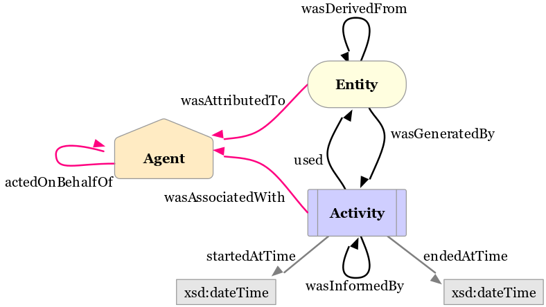

Creating Provenance
===================

Understanding the basics
------------------------

To be able to create provenance data that makes sense and can be used for data analysis, the three basic elements of provenance need to be understood.
The structure of the EDMProv data model is the following:

   see http://www.w3.org/TR/prov-o/
   
   Copyright (c)2011-2013 World Wide Web Consortium, (Massachusetts Institute of Technology, European Research Consortium for Informatics and Mathematics, Keio University, Beihang). All Rights Reserved. http://www.w3.org/Consortium/Legal/2002/copyright-documents-20021231 Status: W3C Recommendation

The main elements are:

*	**Agent**: Somebody who does something.

	This could be a physical person as well as e.g. an organisation. They key thing is that agents have responsibility, meaning they can be blamed.
	PROV-O defines an agent as "... something that bears some form of responsibility for an activity taking place, for the existence of an entity, or for another agent's activity."

*	**Activity**: Something that happens during a given timespan.

	Activities are usually started and ended by agents or entities. They make use of entities and may modify them.
	
	PROV-O defined an activity as "... something that occurs over a period of time and acts upon or with entities; it may include consuming, processing, transforming, modifying, relocating, using, or generating entities."
	
*	**Entity**: Something that is involved in activities but has no responsibility.

	Entities can be created, modified or invalidated during their lifecycle where invalidation means that the entity can no longer be used for further activties. 
	PROV-O defines an entity as "... a physical, digital, conceptual, or other kind of thing with some fixed aspects; entities may be real or imaginary. "
	
**Example:**
	
An example could be a *Beer* entity which is generated by the activity of *DrawBeer* it by the agent *Barkeeper*.
Another agent *Bob* could then start the activity *DrinkBeer* which uses *Beer*.
Once *Bob* ends *DrinkBeer*, *Beer* is invalidated by *DrinkBeer*.
This means that in the knowledge base, *Beer* will still exist, even after it has been drunk. However, the fact that is is invalidated by *DrinkBeer* means that after *DrinkBeer* ends, *Beer* can no longer be used for any other activity and remains in the knowledge base (instead of being deleted after being drink) for data analysis only.

The code for beginners
----------------------

This section shows with a simple example how to create basic provenance statements using the Experimedia ECC Provenance API.

To create provenance statements in ECC client code, you need an EDMProvFactory object: ::

	EDMProvFactory factory = EDMProvFactory.getInstance();

This object will take care of all the internals so that you only have to maintain your agents, entities and activities. As described in `Understanding the basics`_, agents perform activities. Their existence is not inferred which means you need to specify the agents you want to use later in your data analysis: ::

	EDMAgent bob = factory.createAgent("agent_" + UUID.randomUUID(), "Bob Smith");
	
Note that the first argument needs to be unique in your experiment but there are no rules regarding what it needs to look like. The second argument is the human readable label that will be used to display the agent in the provenance GUI of the ECC dashboard.

Next you need to create the entities you want to use: ::

	EDMEntity fritzblitz = factory.createEntity("entity_" + UUID.randomUUID(), "Fritz Blitz ski lift");

The arguments for this are the same as for the agents. Now you might need to get hold of agents and entities you stored at an earlier point. This is done using the following methods: ::

	EDMEntity skilift = factory.getEntity("entity_03a96cb1-73ec-491b-900e-c6dac4f07bcd");
	EDMAgent lisa = factory.getAgent("agent_8cbc76b5-a882-43e3-80e4-c7cd1ae26cd8");

Once you have your agents and entities, you can use them to create activities: ::

	EDMActivity skiing = bob.startActivity("activity_" + UUID.randomUUID(), "Bob's skiing activity", "1399627354");

Again the first argument is the unique identifier, the second one the label and the third one contains a unix timestamp for the start of the activity. The timestamp is optional, so if you don't put it, the current timestamp will be used. Stopping an activity is easy, you just need the activity object created earlier and the timestamp is again optional: ::

	bob.stopActivity(skiing);
	
Some activities are discrete, which means they only occur at a point in time as opposed to a period of time. It would be inconvenient to start and stop the activity, which is why there is a separate method for this purpose. Again, the timestamp is optional. ::

	EDMActivity usedlift = agent.doDiscreteActivity("activity_" + UUID.randomUUID(), "Pressed button", "1399626471");

Now we have agents and activities linked together, but the entities are still isolated. This can be fixed by making an activity use an entity: ::

	usedlift.useEntity(skilift);
	
will create the necessary links in the data model.

Digging deeper into the code
--------------------------

While the simple provenance statements used in section `The code for beginners`_ might be sufficient for some users, there is a lot more that provenance can be used for. This section aims at advanced users wishing to express a greater variety of provenance for a more detailed analysis.

For the understanding of provenance, the basic building blocks of machine-readable semantics - triples - are vital. Basically every statement is represented by a triple. As the name suggests, a triple consists of three parts: ::

	subject - predicate - object
	
The subject in a triple is the active part of the statement. This could be for example Bob. The predicate is the verb of the triple, describing the relationship between subject and object. The object is another thing. While subject and object can be considered as nodes in a graph, the predicate is an edge connecting the nodes.

In Experimedia, all the provenance elements are considered to be the sum of their outgoing relationships. There could be for example Bob: ::

	Bob rdf:type prov:Agent
	Bob hasAge 31
	Bob hasFavouriteIceCream ChocolateIceCream
	
Other elements can refer to Bob, but the relevant triples won't count towards Bob's triples - they would be considered to be part of Alice. ::

	Alice foaf:knows Bob
	
Even though the EDMProv API provides methods to create provenance statements on a higher level, internally everything is represented using triples.

There is a base class called EDMProvElement, representing common behaviours of the three different provenance classes. It is not meant to be used by the end user as its use might lead to a corrupt provenance model. Still it contains methods that may be useful for very specific applications. All of the provenance classes (EDMAgent, EDMActivity, EDMEntity) have their own methods to create links in the provenance model. Since the data model is a directed graph, the method to create a relationship is always at the left side of the relationship (e.g. activity1 -[uses]-> entity1).

For more detailed explanations of what the relationships stand for see http://www.w3.org/TR/prov-o.

What an agent can do
~~~~~~~~~~~~~~~~~~~~

As described above, agents can start and stop activities: ::

	public EDMActivity startActivity(String uniqueIdentifier, String label, String timestamp);
	
	public EDMActivity startActivity(String uniqueIdentifier, String label);
	
	public void stopActivity(EDMActivity activity, String timestamp);
	
	public void stopActivity(EDMActivity activity);
	
	public EDMActivity doDiscreteActivity(String uniqueIdentifier, String label, String timestamp);
	
	public EDMActivity doDiscreteActivity(String uniqueIdentifier, String label);
	
Another thing they can do is to act on behalf of another agent. This means that even though one agent is actually performing activities, another agent takes some responsibility for it. ::

	public void actOnBehalfOf(EDMAgent agent);

What an entity can do
~~~~~~~~~~~~~~~~~~~~~

Entities can - just like agents - start and end activities. Since this is not their main purpose, the convenience method to do a discrete activity (i.e. one that starts and ends at the same time) has been ommitted here. ::

	public EDMActivity startActivity(String uniqueIdentifier, String label);
	
	public void stopActivity(EDMActivity activity);
	
One entity can quote from another entity, an example could be a scientific paper quoting from another paper. ::
	
	public void quoteFrom(EDMEntity entity);
	
An entity can have a primary source. This would apply for example for the translation of a book. ::
	
	public void hadPrimarySource(EDMEntity entity);
	
An entity is a revision of another entity if it is a newer version of it. An example could be Windows 3.1 being a revision of Windows 3.0. ::

	public void wasRevisionOf(EDMEntity entity);

What an activity can do
~~~~~~~~~~~~~~~~~~~~~
Activities can, while they're happening, interact with other provenance elements in a variety of ways.

They could generate a new entity, optionally at a specified time, e.g. baking a cake. ::

	public EDMEntity generateEntity(String uniqueIdentifier, String entityLabel);
	
	public EDMEntity generateEntity(String uniqueIdentifier, String label, String timestamp);
	
They can derive an existing entity, for example painting the roses red. ::

	public EDMEntity deriveEntity(EDMEntity entity, String derivationLabel);
	
Or they can invalidate an entity, rendering it unusable for further activities, e.g. a cheese sandwich, that is being eaten. ::
	
	public void invalidateEntity(EDMEntity entity, String timestamp);
	
	public void invalidateEntity(EDMEntity entity);
	
They can be associated with agents, for example William's pacemaker is associated with William. ::
	
	public void associateWith(EDMAgent agent);
	
They can use entities, that can be provided either as an EDMEntity object or their unique identifier. ::
	
	public void useEntity(EDMEntity entity);
	
	private void useEntity(String entity);
	
An activity can inform another activity, which means that they share and entity in some way like eating a cake is informed by baking a cake as they share the same cake. ::
	
	public void informActivity(EDMActivity activity);
	
Activities can influence each other. This is a more general term for occasions where no specific term can be found. It is recommended not to use this relationship unless absolutely necessary. ::
	
	public void influenceActivity(EDMActivity activity);

The EDMProvBaseElement class
~~~~~~~~~~~~~~~~~~~~~~~~~~~~
This class contains mainly low-level utility methods. It provides a way to inject extra information into provenance objects, which requires a deeper understanding of how the provenance model works. It is highly recommended to prefer the element specific methods over the more generic ones. 

Every element has a human readable name, which is saved as a rdfs:comment triple. ::

    public String getFriendlyName();
    
There is a method to print the triples of an element, ordered by triple type. ::
    
    public String toString();
    
To check whether a specific triple is contained, the following method can be used: ::
    
    public boolean contains(EDMTriple triple);
    
This method retrieves a list of all the prefixes contained in triples where the current element is the subject. This can serve as an overview what ontologies are used. ::
    
    public HashSet<String> getPrefixes();
    
To get the triples contained in a EDMProvBaseElement object, there are several methods. The first one returns all the triples, ::
    
	public HashMap<UUID, EDMTriple> getTriples()
	
The second one allows to filter for a specific triple type (class assertion, object property, data property) or a prefix or indeed both. ::
    
    public HashMap<UUID, EDMTriple> getTriples(EDMTriple.TRIPLE_TYPE type, String prefix);
    
There is another method to only get triples with a specific predicate, which can be useful to filter for relationships like for example prov:used. ::
    
    public HashMap<UUID, EDMTriple> getTriplesWithPredicate(String pred);
    
The next method lists all the incoming relationships, which means the element itself will be the object in the triples returned. This method is only useful when calling it from an element which was read from the database as the triples created using the EDMProv API only contains outgoing relationships to minimise the size of the traffic between the client and the server. ::
    
	public HashMap<UUID, EDMTriple> getIncomingTriples();
	
This is the opposite of the previous method and returns only outgoing relationships, in which the current element is the object. ::
	
	public HashMap<UUID, EDMTriple> getOutgoingTriples();
	
The next two methods are used to add a new triple to the current object. There is an optional argument for a triple type. If not given, the API will assign the "unknown" type, so if the triple type is know, it is strongly suggested to attach it. ::
	
    public void addTriple(String predicate, String object);
    
    public void addTriple(String predicate, String object, TRIPLE_TYPE type);
    
There is also a method to remove triples from the element. Please not that this has no influence on data already stored in the triple store; there is no remote delete method. This method is more like a utility method for rare side cases and should not be necessary for most users. ::
    
    public void removeTriple(String predicate, String object);
    
This is a provenance specific utility method. Since all types of provenance elements can be at a location, this is a shortcut for the prov:atLocation relationship. ::
    
    public void atLocation(EDMProvBaseElement location);
    
The last two methods are also convenience methods for previously introduced methods. They provide and easy way to add and remove class assertions from the current element. ::
    
    public void addOwlClass(String c);
    
    public void removeOwlClass(String c);
    
    
