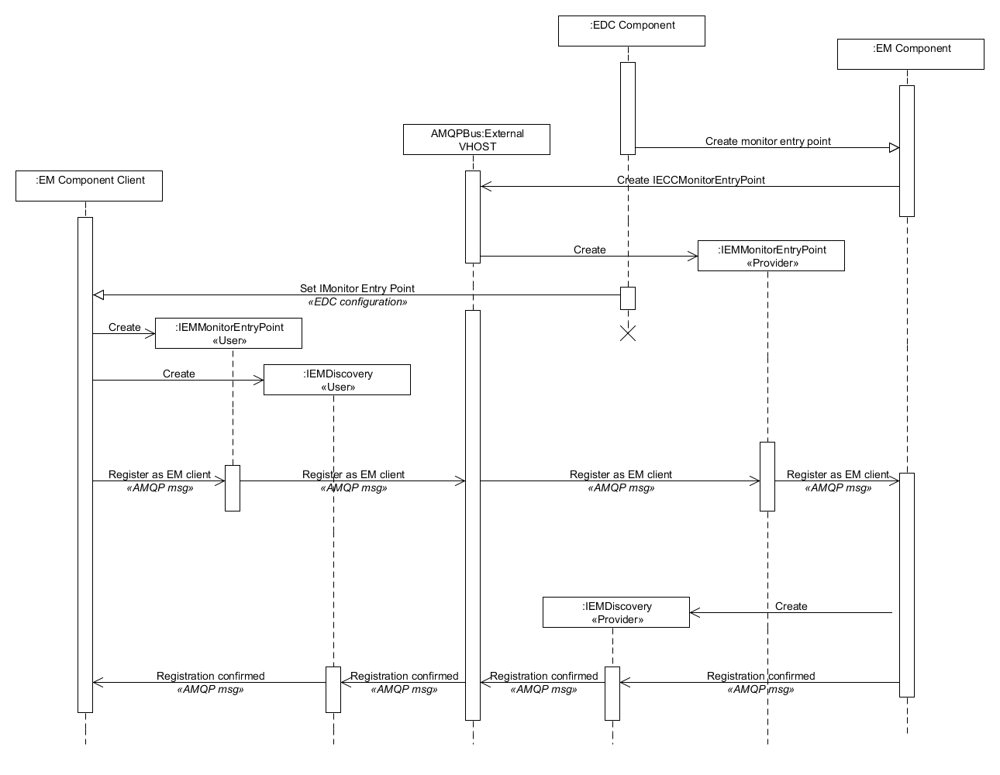
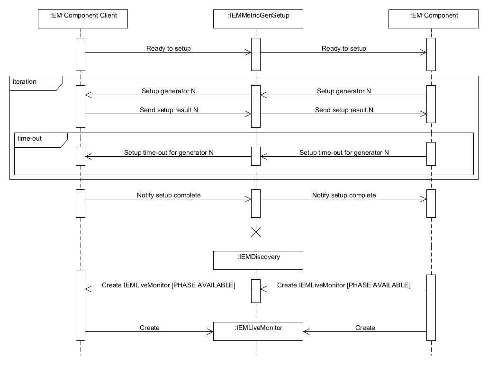
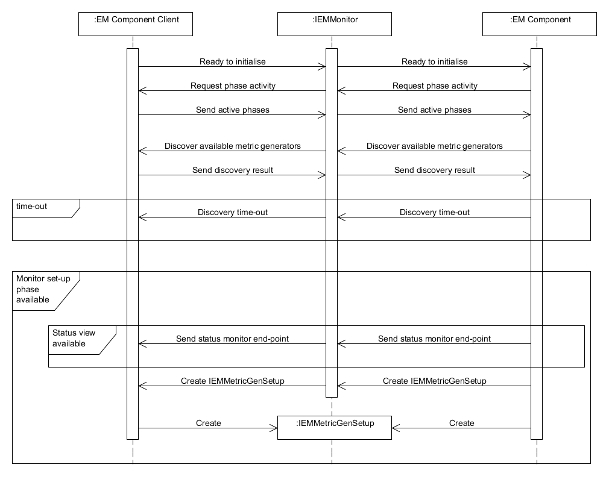
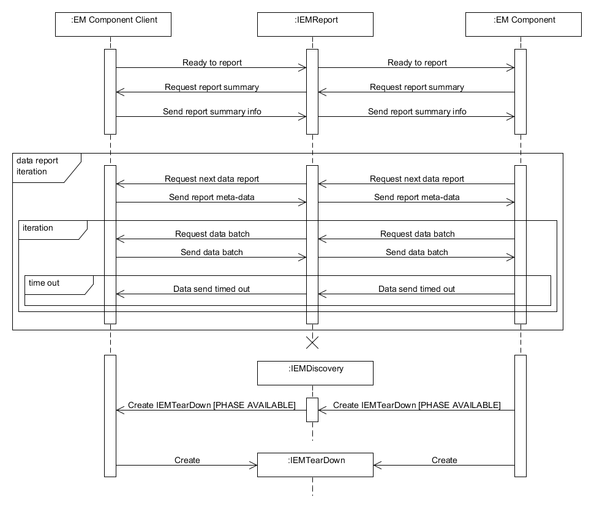
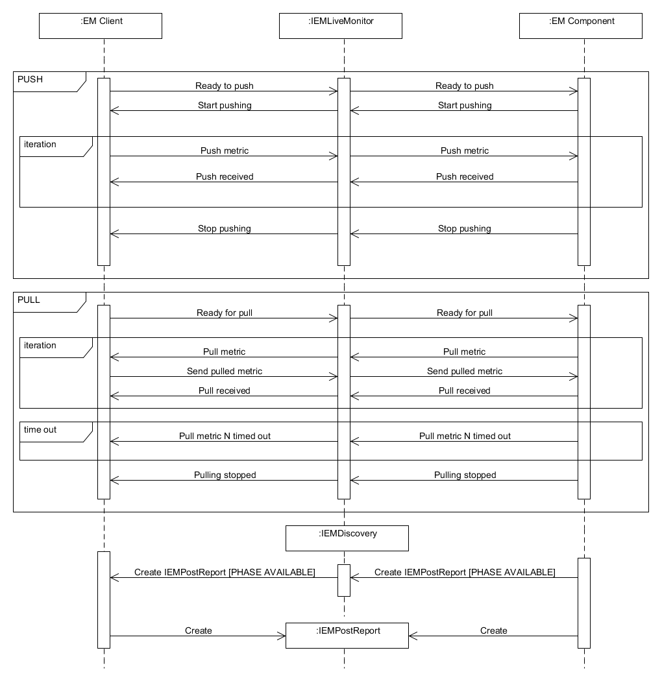
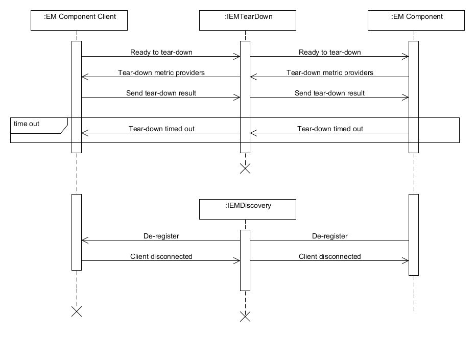

ECC monitoring protocol
=======================

Client connection interface
---------------------------

|image23_png|

Principal interface specification
~~~~~~~~~~~~~~~~~~~~~~~~~~~~~~~~~

::

	public interface IEMMonitorEntryPoint

	{
		void setListener( IEMMonitorEntryPoint_ProviderListener listener );

		void registerAsEMClient( UUID userID, String userName );
	}

	
IEM Discovery interface
-----------------------

|image24_png|

Principal interface specification
~~~~~~~~~~~~~~~~~~~~~~~~~~~~~~~~~

::
	
	public interface IEMDiscovery

	{
		void setProviderListener( IEMDiscovery_ProviderListener listener );

		void setUserListener( IEMDiscovery_UserListener listener);

		void createInterface( EMInterfaceType type );

		void registrationConfirmed( Boolean confirmed,

		UUID
		expUniqueID,

		String
		expNamedID,

		String
		expName,

		String
		expDescription,

		Date
		createTime );

		void deregisteringThisClient( String reason );

		void requestActivityPhases();

		void discoverMetricGenerators();

		void requestMetricGeneratorInfo();

		void discoveryTimeOut();

		void setStatusMonitorEndpoint( String endPoint );

		void readyToInitialise();

		void sendActivePhases( EnumSet<EMPhase> supportedPhases );

		void sendDiscoveryResult( Boolean discoveredGenerators );

		void sendMetricGeneratorInfo( Set<MetricGenerator> generators );

		void clientDisconnecting();
	}

IEM Setup interface
-------------------

|image25_png|

Principal interface specification
~~~~~~~~~~~~~~~~~~~~~~~~~~~~~~~~~

::
	
	public interface IEMMetricGenSetup

	{
		void setProviderListener( IEMSetup_ProviderListener listener );

		void setUserListener( IEMSetup_UserListener listener);

		void setupMetricGenerator( UUID genID );

		void setupTimeOut( UUID genID );

		void notifyReadyToSetup();

		void notifyMetricGeneratorSetupResult( UUID genID, Boolean success );
	}

IEM LiveMonitor interface
-------------------------

|image26_png|

Principal interface specification
~~~~~~~~~~~~~~~~~~~~~~~~~~~~~~~~~

::
	
	public interface IEMLiveMonitor

		{
			void setProviderListener( IEMLiveMonitor_ProviderListener listener );

			void setUserListener( IEMLiveMonitor_UserListener listener );

			void startPushing();

			void notifyPushReceived( UUID lastReportID );

			void stopPushing();

			void pullMetric( UUID measurementSetID );

			void pullMetricTimeOut( UUID measurementSetID );

			void pullingStopped();

			void notifyPullReceived( UUID lastReportID );

			void notifyReadyToPush();

			void pushMetric( Report report );

			void notifyPushingCompleted();

			void notifyReadyForPull();

			void sendPulledMetric( Report report );
		}

IEM Report interface
--------------------

|image27_png|

Principal interface specification
~~~~~~~~~~~~~~~~~~~~~~~~~~~~~~~~~

::

	 public interface IEMPostReport

	 {
	 	void setProviderListener( IEMPostReport_ProviderListener listener );
 
 		void setUserListener( IEMPostReport_UserListener listener );
 
  		void requestPostReportSummary();

		void requestDataBatch( EMDataBatch reqBatch );

		void notifyReportBatchTimeOut( UUID batchID );

		void notifyReadyToReport();

		void sendReportSummary( EMPostReportSummary summary );

		void sendDataBatch( EMDataBatch populatedBatch );
	}

	
IEM TearDown interface
----------------------

|image28_png|

Principal interface specification
~~~~~~~~~~~~~~~~~~~~~~~~~~~~~~~~~

::

	 public interface IEMTearDown

	 {
		 void setProviderListener( IEMTearDown_ProviderListener listener );

		 void setUserListener( IEMTearDown_UserListener listener );

		 void tearDownMetricGenerators();

		 void tearDownTimeOut();

		 void notifyReadyToTearDown();

		 void sendTearDownResult( Boolean success );
	 }

	

