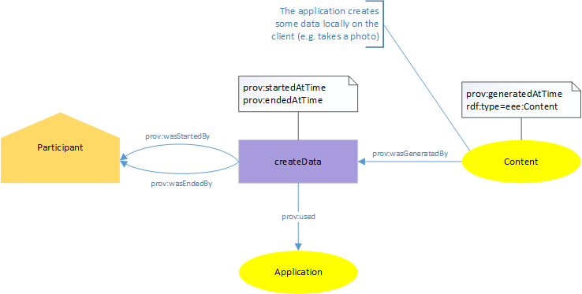
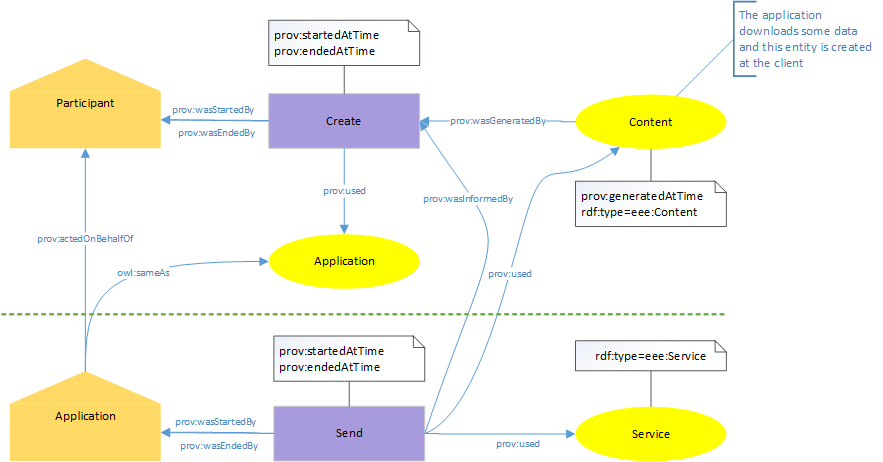
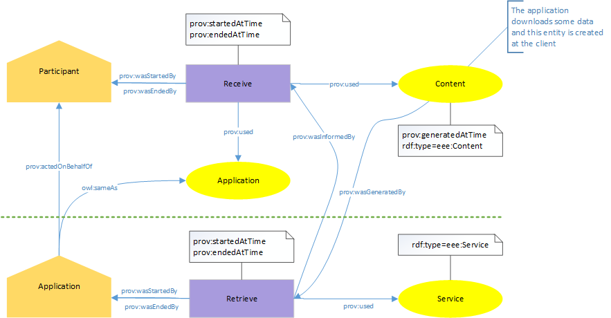

.. _high-level-prov-api:

The High-Level Provenance API
=============================

Introduction
------------

EXPERImonitor uses the W3C PROV ontology to record information about the participants in an experiment and their interactions with applications, services and other entities. The provenance data allows EXPERImonitor to link data such as QoE metric data regarding a participant's experience with QoS metric data regarding the performance of services used by the participant (for instance).

The W3C Prov ontology is a rivh ontology with many ways of representing the same concept. This creates a potential problem: if each experimenter uses the PROV ontology in their own way then (1) they need to understand the detail of the ontology and (2) it will be hard to analyse the data in an automatic way.  For these reasons we have defined an EXPERIMEDIA provenance model. It uses the standard PROV elements in a defined way, providing a wrapper to fit the general experiment theme. This means that an experimenter does not need to understand the detail of the ontology and has the advantage of a homogeneous database after the experiment to facilitate better, faster and more reliable queries.

EXPERImonitor Provenance Model
------------------------------

There are five new classes and one original PROV class used in this data model:

*	**Service**: A service which is provides content for applications. There is typically some QoS associated with a service.
*	**Application**: An application used by a participant, often to retrieve content from a service.
*	**Participant**: A person participating in an experiment.
*	**Content**: A piece of information, which can be used by the articipant or passed between application and service.
*	**Entity**: A real world entity (like e.g. a skilift).
*	**prov:Activity**: An activity which is done by a participant, application or service. It might make use of a service, application or content.

For those that are interested, the relation between these classes and the underlying PROV otology is shown below.

 .. image:: images/provClasses.png
  :width: 80 %
  :align: center

As well as the additional classes we have defined interaction patterns to encode common participant activities.

In the following figures the PROV classes are just represented by the element shapes and other annotations are also omitted for simplicity.

Participant using an Application
~~~~~~~~~~~~~~~~~~~~~~~~~~~~~~~~

In this pattern, the Application is considered to be the running instance of some stored software and is therefore created and subsequently invalidated (destroyed) by the Participant’s Activity which itself links back to the Participant.

 .. image:: images/provUseApp.png
  :width: 80 %
  :align: center

Create Content on Client
~~~~~~~~~~~~~~~~~~~~~~~~

The pattern above would be used when the Participant creates some data locally using the Application (for instance, taking a photo).  The Activity of creating the data uses the Application and the Content entity is generated by the Activity with the creation time also recorded.

Create Content at Service
~~~~~~~~~~~~~~~~~~~~~~~~~

This pattern builds on the previous one in that Content is created by the Participant using the Application (these are the elements above the dashed green line) but in addition the Application’s Agent form is used to initiate an additional “Send” Activity to upload the Content to the Service.

Retrieve Content from Service
~~~~~~~~~~~~~~~~~~~~~~~~~~~~~

The only significant difference between the retrieve and send patterns is the Activity which generates the Content entity.  In this case it is the Application’s “Retrieve” Activity which nominally generates the entity.

Guide to the API
----------------

The ExperimentDataGenerator class of the experimentSimulation sample client provides an example of using the high level provenance API.

Here we show an example of creating provenance statements using the ExperimediaFactory. Internally, the ExperimediaFactory uses an EDMProvFactory, which is created when constructing an ExperimediaFactory. In the constructor we supply the default base URI to use: ::

	ExperimediaFactory factory = new ExperimediaFactory("prefix", "http://my.uri/ns#");
	
There are methods to create all the necessary high-level objects which can either use the default base URI just defined or specify an entirely different URI: ::

	Participant bob = factory.createParticipant("Bob");

	Participant bob = factory.createParticipant("http://facebook.com/bob.smith.10", "Bob");
	
	Service twitterService = factory.createService("Twitter");

	Service twitterService = factory.createService("http://twitter.com", "Twitter");
	
	Entity lift = factory.createEntity("Skilift123", "Skilift Alpenrausch in Schladming");
	
The Application can be created, destroyed or created and destroyed in one go. An application could be, for example, the running instance of an application on a phone so it is created when first started and destroyed when the application exits. The timestamps are unix timestamps without the milliseconds.::

	Application createApplication(Participant participant, String app-name, String start-time)

	Application destroyApplication(Application app, String end-time)

	Application createAndDestroyApplication(Participant participant, String app-name, String start-time, String duration)

For instance: ::

	Application app = createApplication(bob, "MyApp", 1410941780)
	
Then there are a variety of methods to create the provenance patterns described above. They have optional duration arguments. If left out, a discrete activity will be created, meaning that start and end date are identical. ::
	
	Content createDataOnClient(Participant participant, Application client, String dataIRI, String dataName, String timestamp, String duration)
	Content createDataOnClient(Participant participant, Application client, String dataName, String timestamp)

	Activity useDataOnClient(Participant participant, Application client, Content data, String dataName, String timestamp, String duration)
	Activity useDataOnClient(Participant participant, Application client, Content data, String dataName, String timestamp)

	Activity useRealWorldEntity(Participant participant, Entity entity, String timestamp, String duration)
	Activity useRealWorldEntity(Participant participant, Entity entity, String timestamp)

	Activity navigateClient(Participant participant, Application client, String timestamp, String duration)
	Activity navigateClient(Participant participant, Application client, String timestamp)

	Content retrieveDataFromService(Participant participant, Application app, Service service, String dataIRI, String dataName, String timestamp, String duration)
	Content retrieveDataFromService(Participant participant, Application app, Service service, String dataIRI, String dataName, String timestamp)
	
	Content createDataAtService(Participant participant, Application app, Service service, String dataIRI, String dataName, String timestamp, String duration)
	Content createDataAtService(Participant participant, Application app, Service service, String dataIRI, String dataName, String timestamp)
	
For instance: ::

	Content photo = factory.createDataOnClient(bob, cameraApp, "newPhoto_72634876324", "1410941780");

	Activity lookAtPhoto = factory.useDataOnClient(bob, cameraApp, photo, "Bobs photo", "1410941789");
	
	Activity uselift = factory.useRealWorldEntity(bob, lift, "1410941889");

	Activity lookAtPhotos = factory.navigateClient(bob, cameraApp, "1410941915");

	Content hotTweets = factory.retrieveDataFromService(bob, twitterApp, twitterService, "http://example.com/data/hottweets/23", "HotTweets", "1410942001");

	Content tweet = factory.createDataAtService(bob, twitterApp, twitterService, "http://example.com/data/tweet/123", "Send a tweet", "1410942091");
	
Finally, after filling the ExperimediaFactory with data in most cases you want to get hold of the EDMProvReport to send to the EXPERImonitor. This is done by calling the getFactory() method to get hold of the underlying EDMProvFactory which provides all the necessary tools: ::

	EDMProvFactory provFactory = factory.getProvFactory();
	EDMProvReport report = provfactory.createProvReport();

Special cases and advanced programming
--------------------------------------

While it is highly encouraged to only use the ExperimediaFactory to create provenance, we acknowledge there might be the need for special modelling which is not covered. In this case there is good news: under the hood, the ExperimediaFactory creates nothing else than EXPERImonitor Provenance API objects, wrapped in convenient methods to easily create the required patterns. The basic elements are still accessible and can be used as before to attach additional information.

If we created for example a participant like this ::

	Participant bob = factory.createParticipant("Robert Smith");

we might want to add FOAF information. In this case, we can easily get hold of the underlying lower level proveance API like this ::

	bob.agent.addTriple("foaf:knows", "http://my.uri/ns#Alice", EDMTriple.TRIPLE_TYPE.OBJECT_PROPERTY);
	
The contained agent allows access to all the other methods of EDMAgent. The EXPERIMEDIA types contain the following internal provenance API classes:

*	**Service**: EDMEntity
*	**Application**: EDMEntity (to be used by activities), EDMAgent (to perform Activities). Note that these two Provenance types are connected via owl:sameAs
*	**Participant**: EDMAgent
*	**Content**: EDMEntity
*	**Entity**: EDMEntity
*	**prov:Activity**: EDMActivity

More information about the low-level API may be found in the next section.
