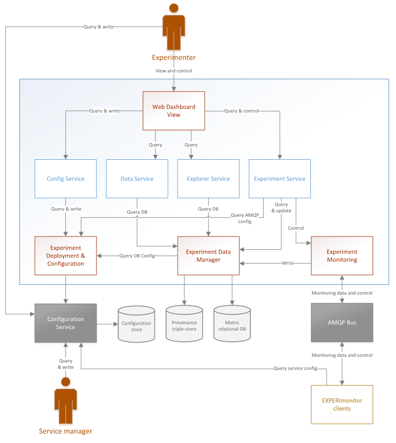

Overview
========

EXPERImonitor is a framework focused on the management of experiment content that allows developers to explore the relationship between QoS and QoE in complex distributed multimedia systems. The tool is specifically designed to support the observation of systems where user-centricity, mobility, ad hoc participation and real-time access to information are critical to success. 

EXPERImonitor uses a hybrid data model that combines formal low level metric reporting with semantic provenance information. The hybrid approach provides the ability to collect large quantities of measurement data (e.g. service response times, network latency, user satisfaction, etc) whilst allowing for exploration of causation between observations within such data (e.g. user satisfaction in relation to service response time). 
 
The ability to efficiently traverse experiment content between QoS and QoE is an essential capability for evaluation of complex socio-technical systems.  Data exploration can provide indications of factors that influence each other and is used to segment data for further investigation and analysis. With ever growing big data sets generated by Internet systems, EXPERImonitor can significantly reduce the time from observation to insight.

EXPERImonitor is a web service with a web-based admin interface and a REST API which connects to clients via RabbitMQ in order to receive high-volume monitoring data.  Client APIs are available in multiple languages (Java, Android, C#, C++, Ruby). The web interface offers a live view of incoming metric data and a data explorer view for completed experiments. Data may also be exported to CSV files for further analysis in more specialised tools.

The software was developed primarily in the `EXPERIMEDIA`_ project to support distributed multimedia experiments. The `3DLive`_ and `STEER`_ projects also contributed to and used the software.

.. _EXPERIMEDIA: http://www.experimedia.eu
.. _3DLive: http://3dliveproject.eu/wp/
.. _STEER: http://fp7-steer.eu/

This document provides:

*   An introduction to the EXPERIMEDIA test-bed context

*   An overview of the EXPERImonitor experiment process and metric model

*   Instructions on how to set up EXPERImonitor within an experiment test-bed

*   Instructions on how to use EXPERImonitor dashboard to execute and monitor an experiment

*   A brief review of each of the EXPERImonitor’s internal components

*   Guidance on how to write an EXPERImonitor software client

EXPERIMEDIA venue based experimentation
---------------------------------------

`EXPERIMEDIA`_ was an FP7 funded project that was focussed on developing and operating unique facilities for large-scale, Future Media Internet experimentation. The experiments were conducted on test-beds situated in advanced and exciting real-world venues that host large communities of people interacting with each other in physical and on-line contexts using new FMI technologies and infrastructures.

.. image:: images/image3.png
   :align: center

Within these venue based communities, EXPERIMEDIA developed a test-bed environment that offers a range of cutting-edge FMI ‘baseline technologies’ (including 3D and augmented reality systems; media streaming services and pervasive gaming) upon which technologists and experiments can build innovative new systems. The overall framework for this environment can be seen in the figure below.

.. image:: images/image4.png
   :align: center

Initial venues chosen by EXPERIMEDIA represent environments that enjoy an advanced set of infrastructure services that are suitable for FMI experimentation. EXPERIMEDIA’s baseline technologies are a set of components (themselves composed of multiple sub-systems) that offer the FMI services including integration with (and analysis of) social networks; pervasive services for mobile users (including user tracking; QoE sampling; and real-world gaming); high quality media/meta-data streaming and user generated content management systems; and 3D human motion acquisition and analysis.

For further information on this architecture and the content components, please see the `EXPERIMEDIA deliverables`_.

.. _EXPERIMEDIA deliverables: http://www.experimedia.eu/deliverables

EXPERImonitor was designed to support the evaluation of FMI systems developed in the EXPERIMEDIA, STEER and 3DLive projects, by:

*   Providing a metrics based experimentation process

*   Providing an Internet based experiment management support system, including:

    *   Semi-automatic deployment of experimentation systems

    *   Metrics monitoring and visualisation

    *   Experiment metrics data management

*   Providing an API intended to support the instrumentation of an extensible range of technologies

An indicative deployment of an EXPERImonitor system and its integration with baseline and new, experimental FMI technologies is depicted in the diagram below. In this illustration, we see two distinct content pathways. First of these is the FMI Content data flow (blue arrows) depicting data interchanging between the technologies used to provide the novel FMI services and experiences to the end user within what is referred to as the EXPERIMEDIA *content lifecycle*. Second, we see the experimental instrumentation integration (orange arrows) between some (not necessarily all) of the technologies delivering services. Metrics creation and management is controlled by the EXPERImonitor via a two-way communication protocol operating with the EXPERIMEDIA *experiment lifecycle*. This protocol is described in further detail in section :doc:`ECC monitoring protocol </mainContent/ECC_monitoring_protocol>`.

.. image:: images/image5.png
   :align: center

In the following sections, the reader is introduced to the EXPERImonitor and its principal components; the experimental process that it supports and the data model that underpins experimental metric capture.

Introduction to the EXPERImonitor
---------------------------------

A high-level architectural overview of the EXPERImonitor architecture is presented in the figure below. 

From an architectural point of view, it is useful to think of the EXPERIMonitor is a collection of experiment related services and APIs. The 'Config', 'Data', 'Explorer' and 'Experiment' services are implemented as RESTful interfaces that provide the facilities required for the web dashboard to run. The application logic that underpins these services are divided into three main components related to deployment and configuration; experiment data management; and (live) experiment monitoring. A summary of these components (and the web dashboard view) is provided in sub-sections below. 

Web Dashboard View
~~~~~~~~~~~~~~~~~~
This component provides a view on both live and previously run experiments carried out using the EXPERImonitor service. It is designed to be experimenter facing, offering control over the creation and execution of experiments as well as allow the experimenter to view metrics live (during experimentation) or explore/export data sets for later analysis.

Experiment Deployment and Configuration
~~~~~~~~~~~~~~~~~~~~~~~~~~~~~~~~~~~~~~~

The ‘Experiment Deployment and Configuration’ component (EDC) provides deployment and configuration functionality for the EXPERImonitor. Configuration details that integrate EXPERImonitor internal components as well as external (metric producing) clients to the EXPERIMonitor service are accessed and updated via this component. These include user name and password configurations for RabbitMQ and PostgreSQL resources and EXPERIMonitor entry point IDs. In addition to this, using EDC resources, developers are able to automatically and rapidly set up an EXPERIMonitor service on a virtual machine using Vagrant/Oracle VM platforms.

Experiment Monitoring (and AMQP Bus)
~~~~~~~~~~~~~~~~~~~~~~~~~~~~~~~~~~~~

The ‘Experiment Monitoring’ (EM) component manages the delivery of experiment data (QoS/QoE metrics) to the EDM from experimentally instrumented technology, connected via an AMQP bus (RabbitMQ is used as the implementation). Experimenters have access to a user interface (a web based dashboard) that controls the experimental monitoring process.

Experiment Data Manager
~~~~~~~~~~~~~~~~~~~~~~~

The EDM manages the storage and retrieval of experiment related data that includes metric and provenance based data. Metric related data is stored in a PostgreSQL 9.1.x (relational) database, according to a schema reflecting the experiment metrics model. Provenance orientated data is persisted by the EDM via connection to a triple store data service. Experiment data is delivered to the EDM for storage by the EM and can be monitored by experimenters via a user interface.

The EXPERIMEDIA experiment process
----------------------------------

The EXPERImonitor offers an experimental process through which remotely connecting EXPERImonitor compliant systems (or users, representing by such systems) are engaged. A linear set of six phases are managed by the experimenter via the EXPERImonitor, depicted in the figure below.

.. image:: images/image7.png
   :align: center

All clients connecting to the EXPERImonitor must engage in the first two phases: *Client connection* and *Discovery*. In the latter stage, the client will declare to the EXPERImonitor which of the subsequent phases it supports; the EXPERImonitor adapts the remaining part of the protocol relating to these phases accordingly. Each of the experiment phases in this process is described in further detail below. A specification of the protocol used to execute each of these phases is provided in section.

Client connection to the EXPERImonitor
~~~~~~~~~~~~~~~~~~~~~~~~~~~~~~~~~~~~~~

Before an experiment is said to begin, clients must connect to the EXPERImonitor. Connections are listened for by the EXPERImonitor dashboard indefinitely until the dashboard user (the experimenter) indicates they have all the clients they need to proceed to the first phase (proper) of the experiment.

Discovery phase
~~~~~~~~~~~~~~~

The discovery phase begins with the EXPERImonitor requesting all connected clients create a discovery interface – a communication point through which the exchange of meta-data regarding the metrics that will be provided is passed. After clients have created this interface, they send an acknowledgement to the EXPERImonitor that they are ready to begin. Subsequently, clients are queried by the EXPERImonitor about a) which of the remaining phases they support and which ‘metric generators’ they are able to provide. A metric generator is a high-level representation of a part of the instrumentation system the client will use to create measurements during the course of an experiment. This abstraction, along with others relating to the metric model, is discussed in more detail in introductory form below and in more technical detail in section :doc:`Writing an EXPERIMonitor Client </mainContent/Writing_an_ECC_client>`.

Set-up phase
~~~~~~~~~~~~

Once all clients have reported their capabilities and metric descriptions, the experimenter moves the experiment phase on and so enters clients (that support it) into the set-up phase. Here, the EXPERImonitor requires the client to progressively set up the metric generators they have available for use. Clients supporting this phase respond with the result of each set-up attempt.

Live Monitoring phase
~~~~~~~~~~~~~~~~~~~~~

Having completed the two ‘preliminary’ phases of the experiment process, the experimenter can then choose to move into a data collection mode called the ‘Live Monitoring’ phase in which all clients that have opted to engage at this stage are signalled that they should start producing metrics. Clients will have specified whether they support the *pushing* or *pulling* (or both) of metric data by the EXPERImonitor. In the former case, clients are able to push any metric of their choosing on an ad-hoc basis (they should always wait for an acknowledgement from the EXPERImonitor after each push, however). Alternatively, clients may be pulled for a specific measurement (identified in their specific metric model) by the EXPERImonitor; a pull request is sent to the client on a periodic basis – it is the client’s responsibility to return the appropriate measure. This phase continues indefinitely until the experimenter concludes that sufficient measurements have been taken.

Post Reporting phase
~~~~~~~~~~~~~~~~~~~~

After the live monitoring phase, the EXPERImonitor will contact the appropriate clients to begin the Post Reporting phase. The purpose of this phase is to allow the EXPERImonitor to retrieve metric data that was not possible to collect during the Live Monitoring phase. For example, some clients may generate data too quickly or have a network connection that is too slow for all of their data to be transferred to the EXPERImonitor in time. During this phase, clients will requested to first provide a summary of all the data they have collected during the Live Monitoring phase, and then be asked to send metric ‘data batches’ that will allow the EXPERImonitor to complete its centrally stored data set for that client.

Tear-down phase
~~~~~~~~~~~~~~~

Finally, some clients may be able to report on their tear-down process for some or all of their metric generators. In some cases, it will be useful for the experimenter to know whether the tear-down process has succeeded or not. For example, the experimenter will need to know whether or not users (represented by the connected client) have been successfully de-briefed on the completion of an experiment.

Primary metric dimensions
-------------------------

An important aspect of the EXPERImonitor’s support for experimental processes is the specification and delivery of various kinds of metrics that will form a significant component of the final analysis of a FMI system. The experiment data and monitoring processes offered by the EXPERImonitor focuses specifically on the generation and capture of *quality of service* (QoS), *quality of experience* (QoE) and *quality of community* (QoC) metrics. The characteristics of each dimension vary and are summarized in the table below.

**Table**
**1**
**: Metric dimensions**

+---------------+----------------------------------------------------------------------------------------------------------------------------------------------------------------------------------------------------------------------------------------------------------------------------------------------------------------------------------------------------------+
| **Dimension** | **Characteristics**                                                                                                                                                                                                                                                                                                                                      |
|               |                                                                                                                                                                                                                                                                                                                                                          |
+---------------+----------------------------------------------------------------------------------------------------------------------------------------------------------------------------------------------------------------------------------------------------------------------------------------------------------------------------------------------------------+
| QoS           | Based on data from a manufactured sensor or computing machine, these measurements are based on objective and verifiable samples of the physical world.                                                                                                                                                                                                   |
|               |                                                                                                                                                                                                                                                                                                                                                          |
+---------------+----------------------------------------------------------------------------------------------------------------------------------------------------------------------------------------------------------------------------------------------------------------------------------------------------------------------------------------------------------+
| QoE           | A synthesis of data that can either be based on quantitative measures from the physical world (such as human-computer interaction logging) or on qualitative data that has been subjectively assessed by a human (an evaluation of the level of ‘immersion’, for example).                                                                               |
|               |                                                                                                                                                                                                                                                                                                                                                          |
+---------------+----------------------------------------------------------------------------------------------------------------------------------------------------------------------------------------------------------------------------------------------------------------------------------------------------------------------------------------------------------+
| QoC           | A synthesis of data, primarily based on objectively measurable features of a social network environment (such as the number of responses in an on-line dialogue). Other qualitative and subjective measures that may be inferred by humans or machines (trained by humans) may also be used (the application of sentiment analysis is one such example). |
|               |                                                                                                                                                                                                                                                                                                                                                          |
+---------------+----------------------------------------------------------------------------------------------------------------------------------------------------------------------------------------------------------------------------------------------------------------------------------------------------------------------------------------------------------+

A selection of metrics from each of these dimensions may be used by an experimenter to better understand how people and technology interact and perform during the course of an experiment.

EXPERImonitor metric model overview
~~~~~~~~~~~~~~~~~~~~~~~~~~~~~~~~~~~

The EXPERImonitor offers a metric modelling framework that offers support for a range of potential QoS, QoE and QoC measurements, see the figure below.

.. image:: images/image8.png
   :align: center

In this model, the objects of experimental observation (referred to as ‘*Entities’*) are de-coupled from the agent (the EXPERImonitor software client) making the observations. Entities themselves must contain one or more *Attributes* that are be the subject of actual instrumentation and measurement activity. A simple example of such a relationship is presented below in which an EXPERImonitor client (called ‘SocialAuth ECC client’) observes a Facebook event.

This very basic relationship need to be developed further however, since a) entities (in this case the ‘Facebook event’) will have certain attributes that are of interest to the client and the b) some organisation of the structure of the metric data associated with the entity must also be prescribed. To see how this is arranged, consider the figure below.

.. image:: images/image10.png
   :align: center

In this example, we have added two attribute instances to the entity, representing aspects of the Facebook we have an interest in observing (i) the number of users attending the event and (ii) the average age of users in the event. We can consider the data management structures that support the collection of data representing these two attributes from either a ‘top-down’ perspective (starting from *Metric Generators*) or from a ‘bottom-up’ view point, starting with a data collection type (the *MeasurementSet* type) that is mapped directly to an attribute of interest. For this example, we will take the latter approach and start by directly linking data sets to an attribute.

The *Measurement Set* type holds a set of measurements that specifically relate to an attribute and in addition has associated with it a metric meta-data indicating its *Metric Type* (nominal; ordinal; interval or ratio) and its *Unit* of measure. In the diagram above, we see two instances of Measurement Sets (each uniquely identified by a UUID value) which are mapped directly to the attributes of interest.

Table 2 : Example metrics

+-----------------------------------------------------------------------------------------------+---------------------+--------------------------------------+------------+----------------+----------------------------+-----------------+
| **Notes**                                                                                     | **Metric**          | **Measurement**                      | **Metric** | **Metric**     | **Attribute**              | **Entity**      |
|                                                                                               | **Group**           | **Set ID**                           | **Type**   | **Unit**       |                            |                 |
|                                                                                               |                     |                                      |            |                |                            |                 |
+-----------------------------------------------------------------------------------------------+---------------------+--------------------------------------+------------+----------------+----------------------------+-----------------+
| QoS examples for a media server running                                                       | Server QoS group    | 2a6bb6b3-2465-4dc5-980b-cb8f78043a7a | RATIO      | Milliseconds   | PING network response      | Media server    |
| an FMI video streaming service.                                                               |                     |                                      |            |                |                            |                 |
|                                                                                               |                     |                                      |            |                |                            |                 |
|                                                                                               +---------------------+--------------------------------------+------------+----------------+----------------------------+-----------------+
|                                                                                               | Server QoS group    | ed3bf728-cd65-4bb3-8453-446f7e56c0f4 | RATIO      | Frames/second  | Video transcoding rate     | Media server    |
|                                                                                               |                     |                                      |            |                |                            |                 |
+-----------------------------------------------------------------------------------------------+---------------------+--------------------------------------+------------+----------------+----------------------------+-----------------+
| QoS example for a client connected to an FMI video streaming service.                         | Client QoS group    | 328cadc6-afea-481a-9b49-9ca3a63ae252 | RATIO      | Frames         | Dropped frame count        | Client receiver |
|                                                                                               |                     |                                      |            |                |                            |                 |
+-----------------------------------------------------------------------------------------------+---------------------+--------------------------------------+------------+----------------+----------------------------+-----------------+
| QoS environment data example                                                                  | Client QoS group    | d8087fbe-ae37-4325-a8ee-79cffc99071c | INTERVAL   | Celsius        | Temperature                | Client device   |
|                                                                                               |                     |                                      |            |                |                            |                 |
+-----------------------------------------------------------------------------------------------+---------------------+--------------------------------------+------------+----------------+----------------------------+-----------------+
| QoE video streaming experience report; a pre-defined 7 point Likert scale is used as a basis. | Client QoE group    | 7620bf4b-0a51-41b8-9a17-870f2454cd78 | ORDINAL    | Likert 7-scale | Perceived video smoothness | User            |
|                                                                                               |                     |                                      |            |                |                            |                 |
+-----------------------------------------------------------------------------------------------+---------------------+--------------------------------------+------------+----------------+----------------------------+-----------------+
| QoE interaction logging (Nominal ‘Action’ definitions should be pre-defined in a dictionary). | Client QoE group    | 8fcfdf27-a51e-455a-8621-47e5fa4d264d | NOMINAL    | Action         | Video player interactions  | User            |
|                                                                                               |                     |                                      |            |                |                            |                 |
+-----------------------------------------------------------------------------------------------+---------------------+--------------------------------------+------------+----------------+----------------------------+-----------------+
| QoC activity for FMI community                                                                | QoC community group | 5fb41674-490a-4bb8-be99-e20adf2fd7e1 | RATIO      | Log-ins/day    | User log-ins               | FMI community   |
|                                                                                               |                     |                                      |            |                |                            |                 |
+-----------------------------------------------------------------------------------------------+---------------------+--------------------------------------+------------+----------------+----------------------------+-----------------+
| QOC activity for user of FMI community (URL                                                   | QoC user group      | 0b789291-4392-4288-95af-544486508a85 | NOMINAL    | Content post   | User content               | Client device   |
| to publicly available content)                                                                |                     |                                      |            |                |                            |                 |
|                                                                                               |                     |                                      |            |                |                            |                 |
+-----------------------------------------------------------------------------------------------+---------------------+--------------------------------------+------------+----------------+----------------------------+-----------------+

In the table above a number of illustrative examples of metrics from QoS, QoE and QoC domains are shown (with notes to offer context). Reading from left to right, we can see how groups of metric sets (each with an associated metric type and unit) are mapped to the entities under observation in the real or virtual world. To save space, metric generator mappings have not been included.

Moving up the data hierarchy, the next level of logical organisation is the *Metric Group* – a container used to perform one level of partitioning for collections of measurements that relate (for example, video rendering metrics). Metric Groups themselves are collected together by the top level data organisation, the Metric Generator. As previously indicated, the Metric Generator represents system-level components that generate metrics, for example it may be useful to differentiate server and client based metric generators. An additional mapping, similar to that used to link measurement data sets to attributes is specified linking metric generators to entities under observation since it is likely that individual systems will be deployed to observe different entity types. EXPERImonitor client software must send their specification of the metrics they are going to provide the EXPERImonitor in this way, during the Discovery phase. In this way, the experimenter has a means by which to understand which clients are performing what kind of measurements, and what they relate to within the experimental venue.

