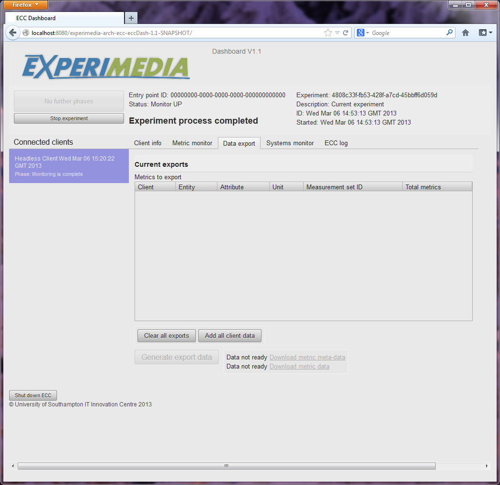
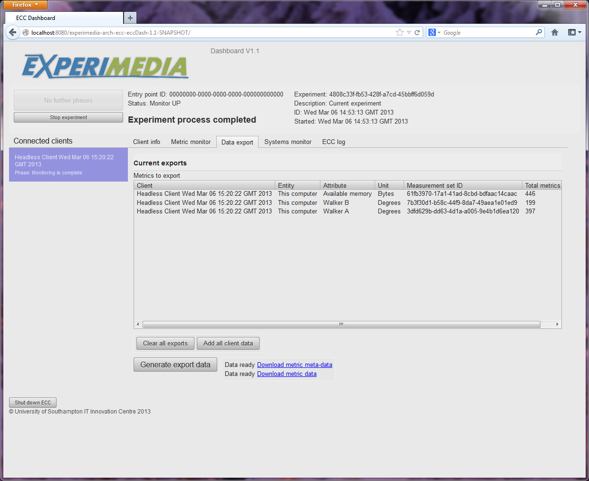
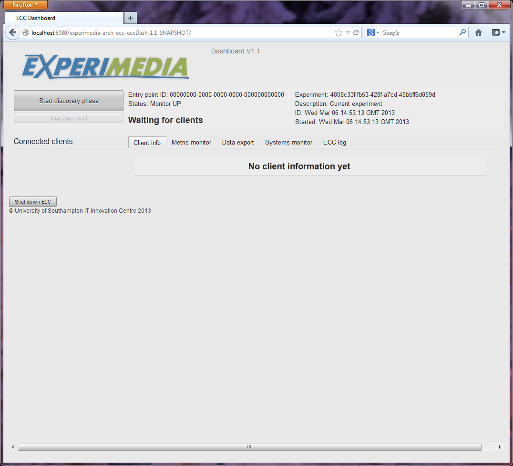
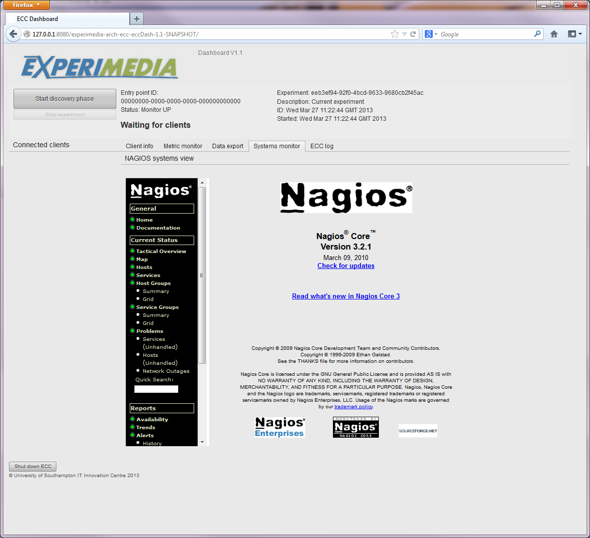
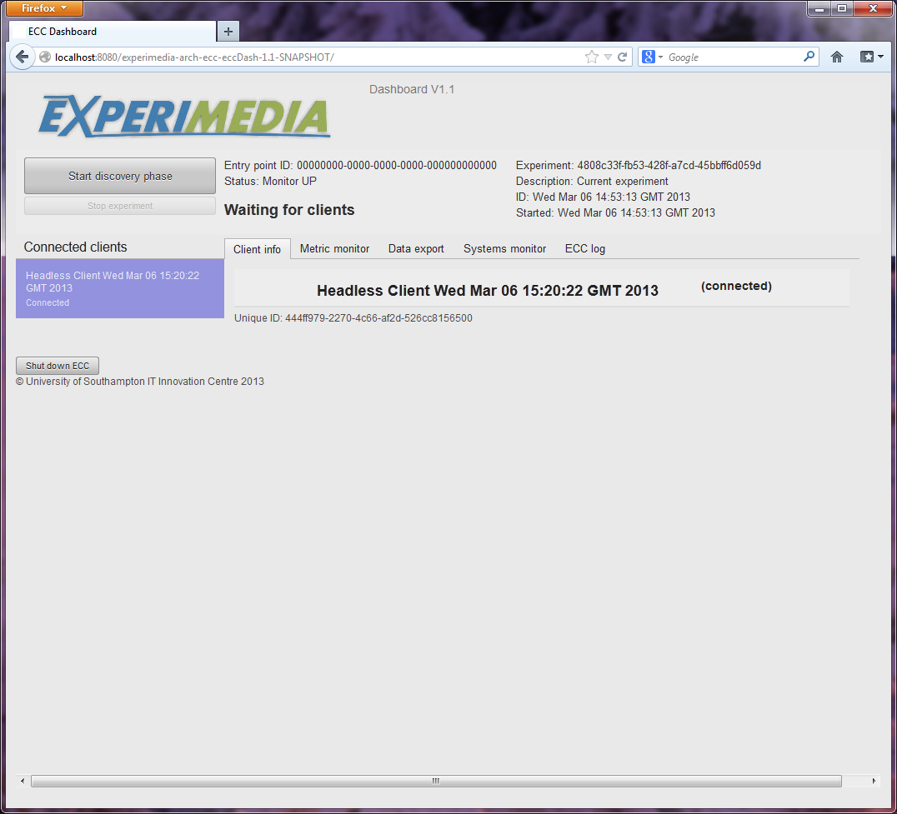
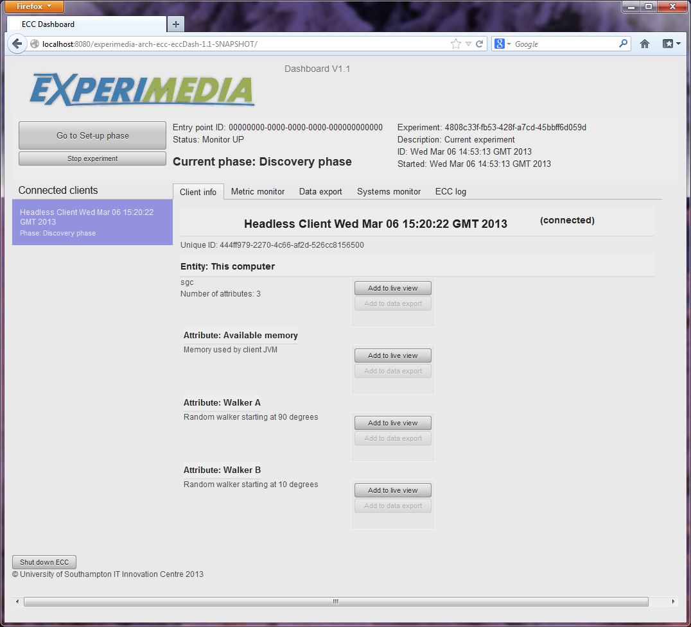
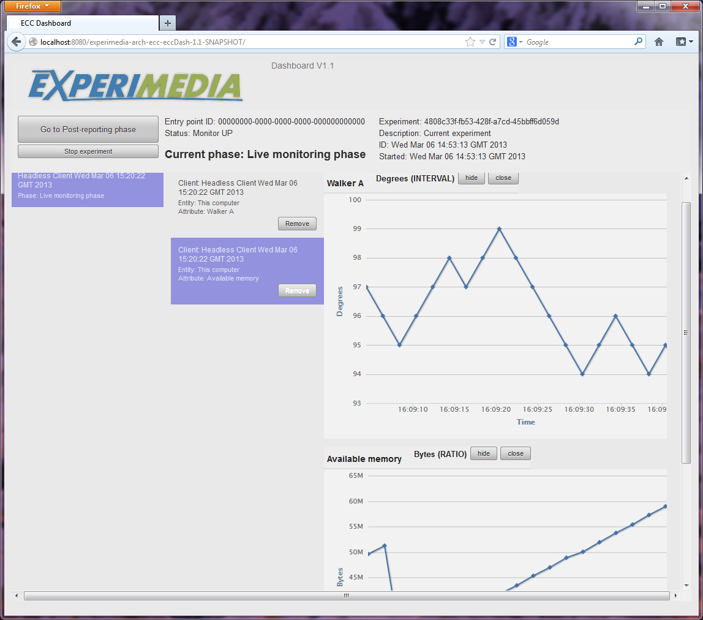
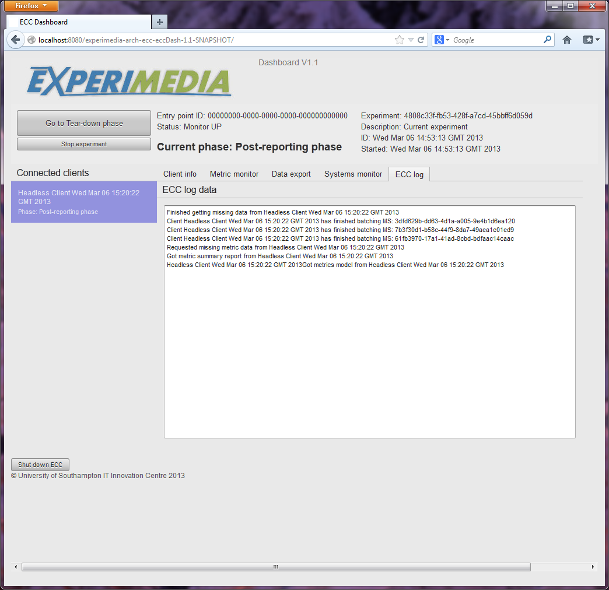

Using the ECC Dashboard
=======================

After building and deploying the ECC it is then possible to configure the ECC, start and control an experimental process using the ECC Dashboard.

ECC Configuration View
----------------------

After deploying the ECC, you should be able to access the ECC Configuration page in your browser (see :doc:`Getting started with the ECC </mainContent/Getting_started_with_the_ECC>` section):

 .. image:: images/dashboard_configuration.png
  :width: 100 %

You should be able to use any configuration by manually entering the details on the right side of the screen, choose between or use as a template:

#. Local configuration loaded from **application.properties** file (located in **eccService/src/main/resources** folder in source distribution or in **EccService-2.0/WEB-INF/classes** folder in your web server deployment).

#. Remote configurations located at WebDAV server config.experimedia.eu.

Once you have selected a configuration, you have an option to save it on config.experimedia.eu by checking "Save or update this configuration on WebDAV server" (existing configurations will be overwritten). **Use this configuration** button will submit the configuration to the ECC. In case of configuration being invalid or selected RabbitMQ/Database servers inaccessible, a warning message will be displayed and you will be able to edit the configuration and try again. Otherwise, you should be redirected to the Experiment view of the Dashboard.

ECC Experiment View
-------------------

Depending on your current ECC state (experiment in progress, previous experiments stored in the database, clean install), this view will always show a dialog window with all or some of the following options:

#. Go to current experiment (only if an experiment is in progress).

#. Browse data for one of the latest experiments (previous experiments stored in the database).

#. Start new experiment (always available)

 .. image:: images/dashboard_select_experiment.png
  :width: 100 %

Starting a new experiment
~~~~~~~~~~~~~~~~~~~~~~~~~

Select **Start new experiment** in the dialog window and click **Let's Go**. Give your experiment a name and description beforehand, which is optional. You should see the following:

 .. image:: images/dashboard_empty_experiment.png
   :width: 100 %

Connect your clients and click **Refresh Clients, Entities and Attributes below** button. All clients and their metrics should appear like so (EXPERIMEDIA SAD service used as an example):

 .. image:: images/dashboard_sad_connected.png
   :width: 100 %

Use drop-down menus in respective columns to filter Clients, Entities (by client) or Attributes (by entity). **Download data** links will start CSV file download for:

* Whole experiment (all reported entities and attributes).

* Single client (the client's entities and attributes).

* Single entity (the entity's attributes).

* Single attribute.

Metrics reported by ECC clients can be monitored live in **Live Metrics: up to 10 latest measurements** part of the page by adding them with **Add to Live metrics** controls on Clients, Entities or Attributes. Live metrics can be removed individually or by Client/Entity/Attribute by clicking on **Remove from Live metrics** link.

 .. image:: images/dashboard_sad_service_entity.png
   :width: 100 %

Clicking on **Refresh Clients, Entities and Attributes below** button will clear live metrics display and refresh all clients and metrics list.

Joining experiment in progress
~~~~~~~~~~~~~~~~~~~~~~~~~~~~~~

Select **Current experiment** in the dialog window if this option is available and click **Let's Go**. You should see currently connected clients and their metrics in Clients, Entities, Attributes part of the view. You will have to use **Refresh Clients, Entities and Attributes below** button to keep that list current.

Browse data for one of the latest experiments
~~~~~~~~~~~~~~~~~~~~~~~~~~~~~~~~~~~~~~~~~~~~~

Experiment controls
~~~~~~~~~~~~~~~~~~~

you should be presented with an initialised ECC dashboard that is waiting for clients
to connect.

|image12_png|

Figure
2
: ECC dashboard waiting for clients

The **process control** part of the user interface provides the experimenter with overall navigation through the experimental process supported by the ECC (see section
for an overview).
Iteration through the phases is controlled by using the phase control button, top left of the process control view. The experimenter is also provided with information regarding the state of the experiment (initially, waiting for clients to connect)
as well as some meta-data relating to the experiment instance itself (top right).

Directly below the process control view, the currently connected ECC clients are presented in a column along the left hand side; these will appear as clients
individually connect to the ECC via the RabbitMQ server.

Additional informating relating to clients, in-coming metrics and connected systems are presented in the tabbed views, summarised below:

*   **Client info view**

The client info view provides information about the connected clients status and the metrics they are offering the ECC during the course of the experiment. This information is updated whilst the experiment is running.

*   **Metric monitor view**

This section of the UI contains metric visualisations(such as graphs and charts) of metric data streams selected by the experimenter during the *Live Monitoring* phase. These can be dynamically added and removed during the course of the experiment.

*   **Data export view**

After the main data collection phases (Live Monitoring and Post-Reporting) have completed, the experimenter has the opportunity to export all or selected metric streams to a CSV file format, which can be downloaded. The data export view supports this process.
See section
for further information.

*   **Systems monitor view**

If configured the ECC dashboard will also provide an embedded NAGIOS systems monitoring view.
Clicking on the **Systems monitor** tab will provide the experimenter with direct access to this sub-system.

*   **ECC log view**

A systems logging view of the activities of the ECC dashboard is provided in this part of the tabbed view. It provides low-level system messages that may be useful in understanding the technical interactions of connected clients with the ECC.

Systems monitor view
~~~~~~~~~~~~~~~~~~~~

Additional monitoring support is provided to the experimenter by offering a systems-level view of their technical infra-structure by embedding a NAGIOS view directly into the dashboard (see below).

|image13_png|

A NAGIOS system can be integrated with the ECC dashboard by configuring the dashboard specification file (
*dashboard.properties*
) to point to the full URL of your NAGIOS
monitoring system.
Please note that you must use a browser that supports cross-site web page embedding (such as Firefox) to use this feature.

Connected clients
-----------------

In many cases, it is expected that at least some metric reporting systems will initially connect with the ECC before the experiment process begins proper.
At this (or a later) stage, those client connected to ECC will appear on the left hand side of the view, see below.

|image14_png|

Figure
3
: Client connected to the ECC

Clicking on the clients displayed on the left hand side of the screen will present further information (when it becomes available) under the client info tabbed view.
Packaged in the ECC software archive are the following test clients that can be used to test connection to the ECC:

*   **Basic ECC Client**

This client provides a simple GUI with which a client user can actively push a simple metric to the ECC during the Live Monitoring phase. It supports all phases of the ECC experiment processes, but does not support independent storage of the metric data it generates.

*   **Headless ECC Client**

This client offers no user interface and can only be run (non-interactively) from the command line.
In contrast to the Basic ECC Client, it locally stores metric data (as well as sending it to the ECC) and will provide missing data to the ECC during the Post-Reporting phase.

*   **Basic Android Client**

This client is very similar in function to the Basic ECC client described above in that it demonstrates basic connectivity with the ECC and allows the user to push a simple metric to the ECC during Live Monitoring. To build this client you will need to download Googles Android SDK.

Executing the Discovery Phase
-----------------------------

Clicking the process control button (**Go to Discovery phase**) starts the experiment process proper. Connected clients will be requested for an enumeration of the
entities and their attributes
they will provide
metric data about
to the ECC (this is displayed under the client info tabbed view, see figure 4).

|image15_png|

Figure
4
: Discovery phase

This now allows the experimenter to review what is being measured by the connected client and select which of the metrics associated with each entity/attribute will be visualised during the Live Monitoring phase.
Click on the **Add to live view** button to add an entity or attribute to the metric monitoring tabbed view.

Executing the Set-up Phase
--------------------------

Clients that support the interactive set-up phase offered in the ECC experiment process will be contacted by the ECC and instructed to perform their specific set-up process.
Click on the phase control button to start this phase; the result of this set-up process will be displayed in the client information view.

Executing the Live Monitoring Phase
-----------------------------------

Live monitoring could be considered the most active data capture phase of the ECC experiment process. Connected clients (supporting *pulling* behaviour)
are regularly polled for their metric data during this phase, those metrics selected by the experiment can be visualised using the metric monitoring view (see figure 5).

|image16_png|

Figure
5
: Live monitoring view

Visualisations can be actively managed by use the *hide* and *close/remove* buttons for each visualisation instance.
All metric data supplied by the connected clients (visualised or not) will be stored in the ECC database.

Executing the Post-Reporting phase
----------------------------------

At some point the experiment will wish to end the Live Monitoring phase (the time for this is entirely up to the experimenter); once this time has passed clicking the phase control button (labelled **Go to Post Reporting phase**) will close the live monitoring process. Connected clients will be told to stop sending metrics and then asked for a basic summary of all the metrics they have generated.

|image17_png|

Figure
6
: Post Reporting result log

Any metrics not collected during the live phase will be retrieved by the ECC from each client (that supports Post Reporting) in batches, the results of which can be viewed in the ECC log view, see
.

Executing the Tear-down phase
-----------------------------

Finally, the experimenter will enter the Tear Down phase by once again clicking on the phase control button.
Connected clients that support this phase will be requested by the ECC to execute their specific tear-down process and report back the result to
the ECC (displayed in the log).

|image18_png|

Figure
7: Tear-down phase completed; ready for data export

The experimenter is now ready to finalize the experiment, but before doing so may wish to export the metric data collected for subsequent analysis.

Exporting metric data
---------------------

Data collected during the course of Live Monitoring and/or recovered during Post Reporting can be downloaded by the experimenter using the Data export
facility in the ECC dashboard.  A summary of all the metric data to be downloaded is described in the **Current exports** table. Data from individual clients can be added to the current exports table by visiting the client information tabbed view or all data can be selected by clicking the **Add all client data** button.

|image19_png|

Figure
8
: Data export view with client data summary

The ECC will generate the appropriate export data when the experimenter clicks the **Generate export data** button. Once the data has been compiled and is ready for download, two links will appear on the user interface to allow download. These are:

*   **Download metric meta-data**

Provides a CSV file containing the data displayed in the current exports view. This links the Measurement set IDs with the attribute, entity and client related to it.

*   **Download metric data**

Provides a CSV file containing
the actual metric data itself, indexed by Measurement set IDs.

Once the experimenter has gathered their data, it is time to formally stop the experiment (using the **Stop experiment** button). This will finalise the experiment by disconnecting all clients and re-starting the dashboard with a new experiment.

